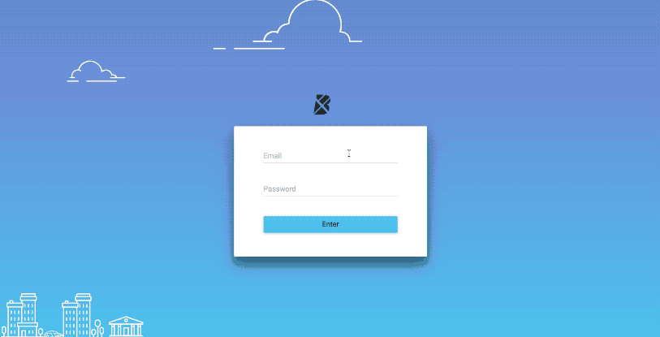

# Boomtown

An items sharing single-page app built on React, Redux, GraphQL.



## Instructions
### Installation

Download the repo, then run:

```bash
npm install && cd client && npm install
```
### Develop Mode

From inside the root directory, run:

```bash
yarn start:dev
```
### Build for Production
```bash
yarn build:react
```
## Features

* Use React on the client side - different components in Layout, React Routing for page navigation
* Seperate Components (presentational components) and Containers (functional components)
* On server side, use GraphQL for smart data queries (quering from posrgreSQL as well as firebase database), assisted with Apollo 2.0 for connecting client side and GraphQL
* Incorporating Redux for tags filtering functionality (passing props from headerBar to appContent)

## Author

**Qingxin Yuan**

## Acknowledgement

* Thanks RED Academy for design and materials preparation
* Thanks [Mackenzie Kieran](https://github.com/10thfloor) for tips on deploying app to Heroku